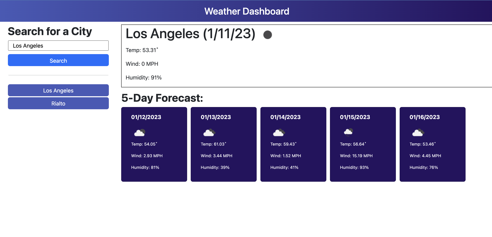

# <weather-dashboard>

## Description

The application should prompt the user to input any city in the world to look up the current weather conditions along with a 5-day weather.

Given an Acceptance Criteria, the user should experience an error free application that prompt them a city. After an valid city input is given, the user is then displayed a reoccuring history of their search history, as well as a status of the weather that day and in the next 5 days.

## Installation

 * To deploy application, go to [weather-dashboard](https://erickjavalos.github.io/weather-dashboard/)

## Usage

 * Type city into Search Bar

